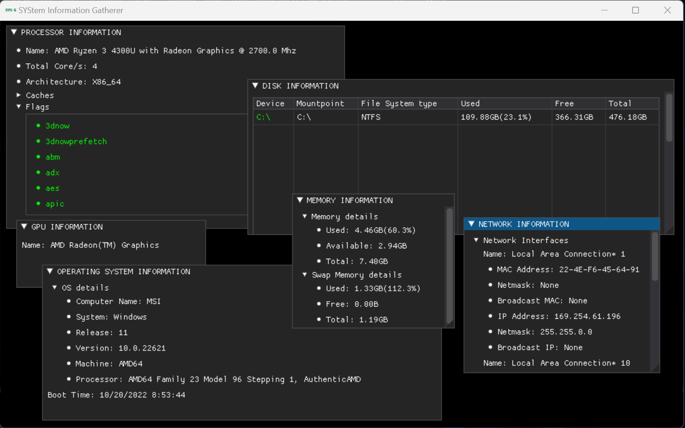

*SYStem Information Gatherer*

## Introduction

This is a small and simple GUI tool to gather your computer information using python.

This project is just for fun and to learn python/dearpygui, mostly copy paste(check [credits](#credits)) hehe :sweat_smile:

## Sample

> This is my PC spec, I know. please don't.

## Credits

[Hardware detection in python](https://www.thepythoncode.com/article/get-hardware-system-information-python)

[DearPyGUI](https://github.com/hoffstadt/dearPyGui/)